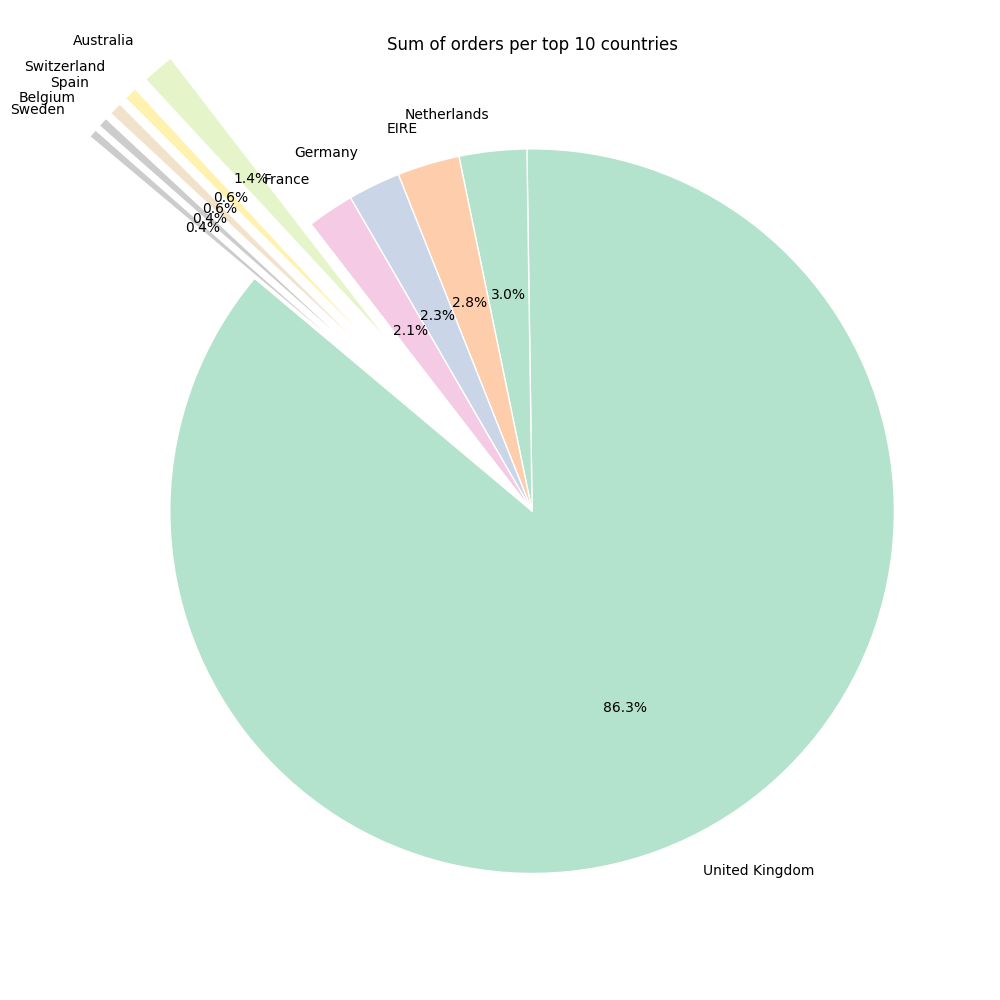
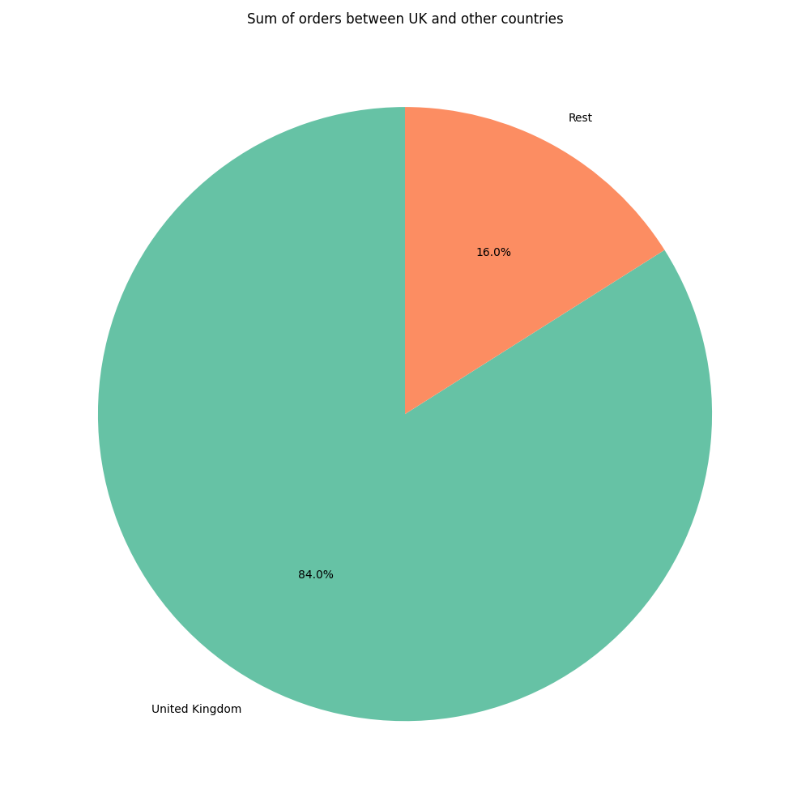
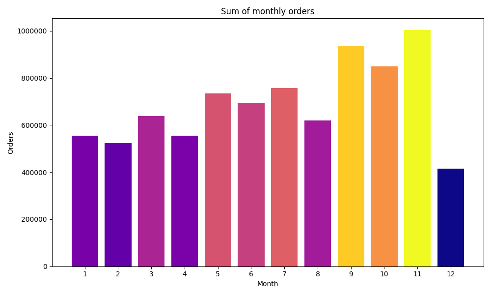
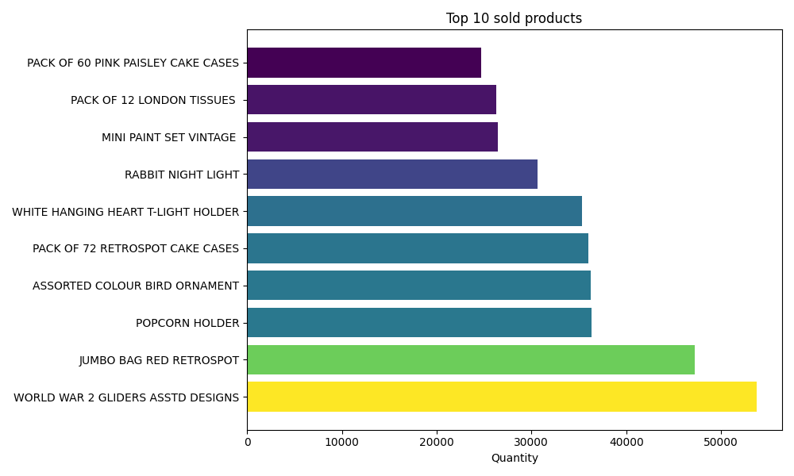
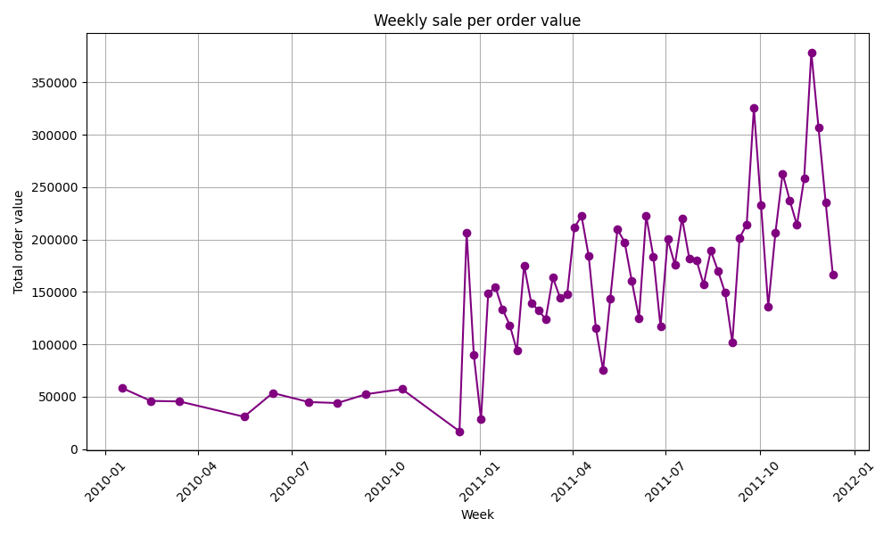
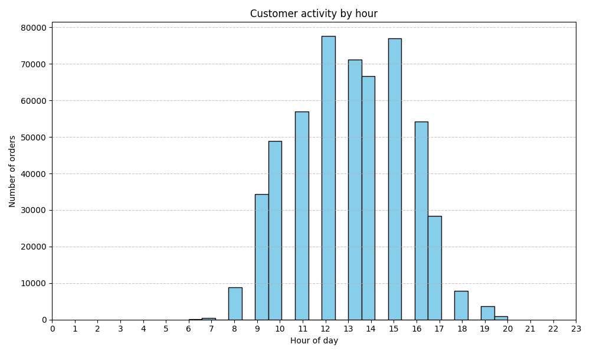
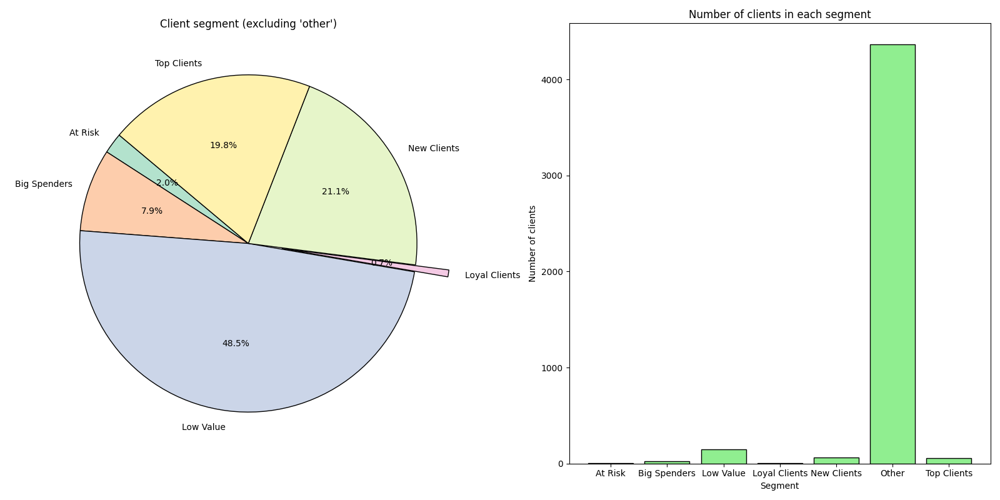
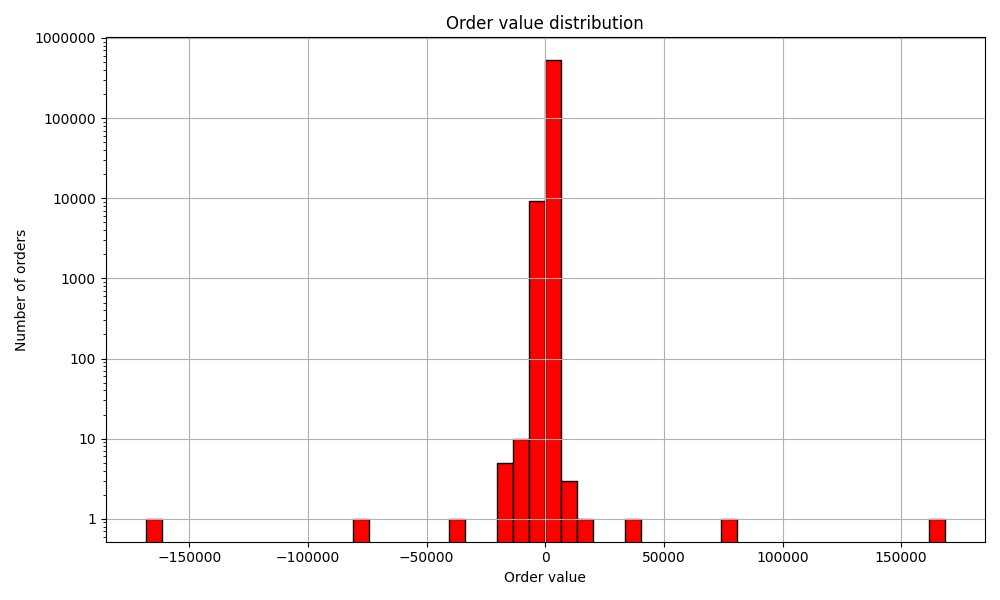
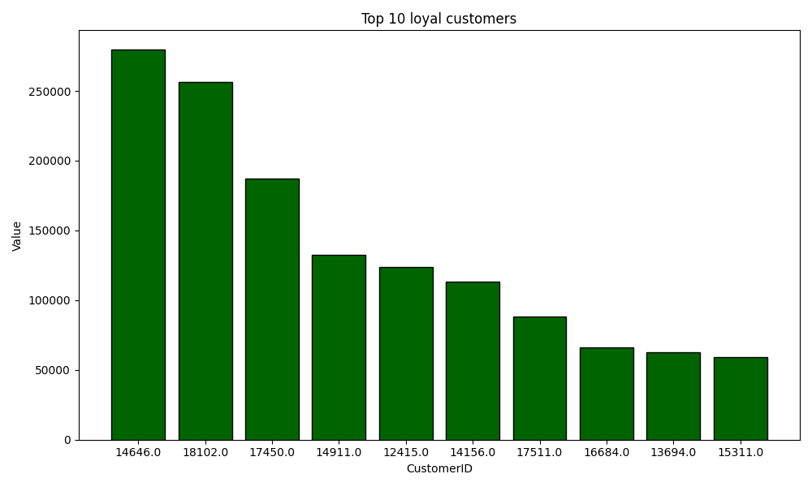

# Sales Analysis ETL

## **Project description**
This project uses open data from https://www.kaggle.com/datasets/carrie1/ecommerce-data. It includes data cleaning, tranformation and visualization. The dataset was transformed into SQL database (sqlite).

## **Features**
* ### Visualizations: 
  * Used line chart, bar chart, pie chart, histogram and combined charts. 
  * Plots were customized for clarity and better interpretation of outputs.

* ### SQL Database:
  * Database was created from mentioned csv data.
  * All transformations were added to the database.

## **Tech Stack**
- Pandas
- Matplotlib
- Seaborn
- NumPy
- Sqlite

## **Project structure**
* /**data:** Folder with raw data and database.
  * /**e-commerce.db**
  * /**e-commerce_data.csv**
*/**etl:** Python scripts used in the project.
  * /**load_data.py**
  * /**sales_insights.py**
  * /**transform_data.py**
* /**outputs:** Results of data visualization.
  * /**order_value_distribution.png**
  * /**orders_by_hour.png**
  * /**orders_weekly.png**
  * /**orders_per_country.png**
  * /**orders_per_country_uk_rest.png**
  * /**sale_per_month.png**
  * /**segments.png**
  * /**top_10_clients**
  * /**top_products.png**
* /**.gitattributes**
* /**README.md:** Main documentation of the project.

## **Data description & Visualization**
### Orders Per Country
* **File:** "orders_per_country.png"
* **Description:** Pie chart visualizing countries participation percentage in sales.
* **Conclusion:** United Kingdom dominates in orders holding over 85% of them in top 10 and almost 85% in total.

---

### Sale Per Month
* **File:** "sale_per_month.png"
* **Description:** Bar chart showing sum of sales per month.
* **Conclusion:** Highest sale occurs in November and drops to the lowest in december. This might be counterintuitive to the fact that winter christmas usually notes spike in sales.

---

### Top 10 Sold products
* **File:** "top_products.png"
* **Description:** Horizontal bar chart visualizing top sold products per quantity.
* **Conclusion:** "World War II Gliders Asstd Designs" were sold at the most number. Second most sold product had slightly less sold amounts.

---

### Cross-Validation Results
* **File:** "cross_val_lin.png"
* **Description:** Shows 10-fold cross-validation scores for both models.
* **Conclusion:** Performance is very similar. Logistic Regression may be preferred due to its simplicity.

---

### Orders Per Week
* **File:** "orders_weekly.png"
* **Description:** Line chart visualizing weekly sale per order value.
* **Conclusion:** The chart presents significant spike of order values in 2011 comparing to 2010. This could be linked to many factors, expansion of the market of a company i.e.

---

### Hourly Activity
* **File:** "orders_by_hour.png"
* **Description:** Histogram showing customer orders activity per hour.
* **Conclusion:** Customers were the most active between 12-15.

* 

---

### Clients Segments
* **File:** "segments.png"
* **Description:** Combined pie chart and bar chart with customer segments. Pie chart excluded "other" category as it was covering over 90% of customers.
* **Conclusion:** "Other" customers are the greatest segment of customers. With exclusion of "other" category "low value" customers hold almost 50% of the segment.

* 
---

### Distribution of Order Value
* **File:** "order_value_distribution.png"
* **Description:** Histogram with order value distribution.
* **Conclusion:** Low cost products holds the greatest number of orders. Some negative values suggest returned orders.

* 

---

### Top 10 Clients Per Order Value
* **File:** "top_10_clients.png"
* **Description:** Bar chart with CustomerID of the most loyal customers by order value.
* **Conclusion:** Customer 14646 is the most loyal customer.

* 
---

## Final Thoughts
This project demonstrates the full workflow of an ETL process:
* Data clearance and transformation into SQL database.
* Data manipulation.
* Data visualization.